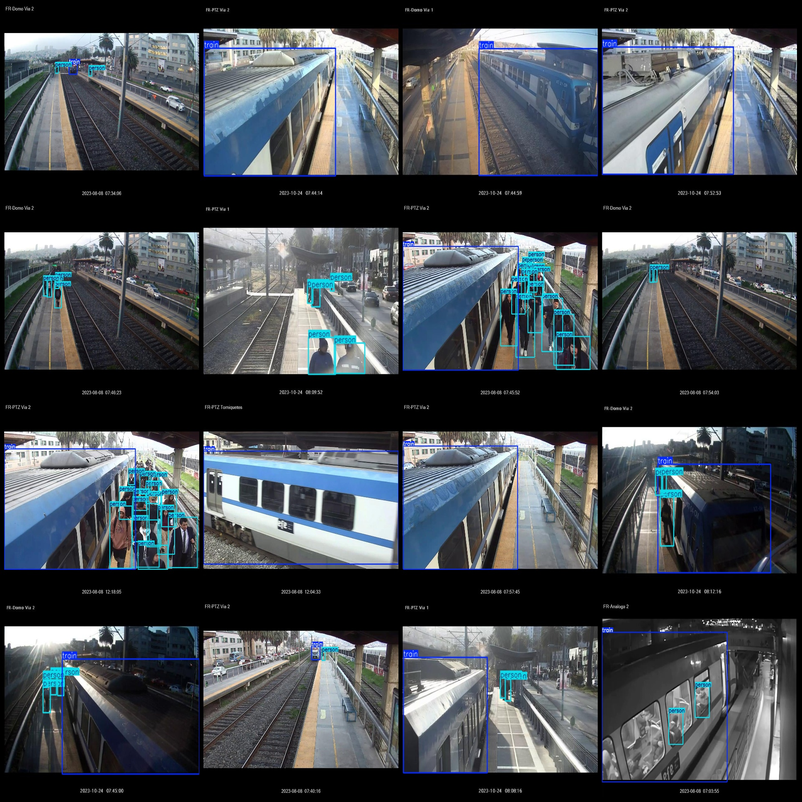
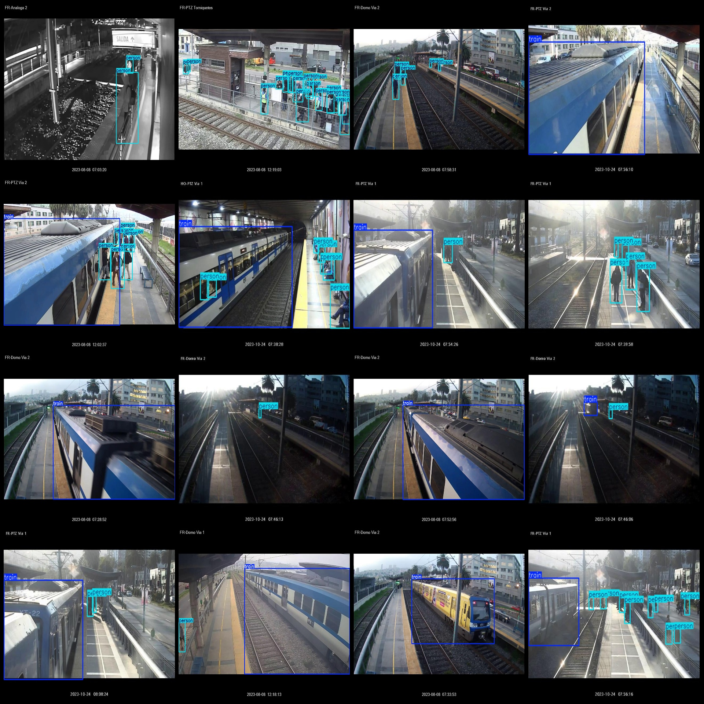

# Intelligent Railway Train and Person Detection Dataset: VOC+YOLO Format with 5059 Images in 2 Categories

The dataset format consists of Pascal VOC format + YOLO format (without the split path, only containing jpg images along with corresponding VOC format xml files and YOLO format txt files).

- Number of images (jpg file count): 5059
- Number of annotations (xml file count): 5059
- Number of annotations (txt file count): 5059
- Number of annotation categories: 2
- Annotation category names (note that the order in the YOLO format does not correspond to this, and is based on the labels folder's classes.txt): ["person", "train"]
- Box counts for each category:
  - person box count = 24358
  - train box count = 3639
- Total boxes: 27997
- Boxes per image for each category:
  - person per image count = 3843
  - train per image count = 3486
- Image resolutions: Multi-resolution images, such as 640x480, 1280x1024, etc.
- Annotation tool used: labelImg
- Annotation rules: Draw rectangle boxes for each category
- Important note: The dataset does not have separate training, validation, or test sets; users must divide them themselves.
- Special declaration: This dataset does not guarantee the accuracy of the trained models or weight files.
- Preview of images:
- Example of annotation:

## Images

Here is a pay link on Stripe ( https://buy.stripe.com/3cs8yP7sY87d0vu9AB ). Please contact me lonlonago@foxmail.com after funding $89, and I will send you a complete data files , thank you!

